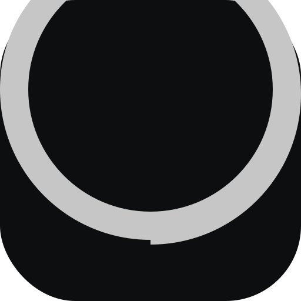

# MyPomo - Pomodoro Timer

A beautiful, functional Pomodoro timer with statistics tracking, built with Vue 3, TypeScript, and Vite.



## Features

### 🍅 Timer Functionality
- **Focus/Rest Modes** - Switch between focus and rest modes with visual feedback
- **Preset Durations** - Quick-select 5m, 10m, or 25m presets
- **Custom Time Input** - Enter any custom duration (minutes:seconds)
- **Auto-Stop** - Timer stops at 00:00 automatically
- **Pause/Resume** - Pause and resume timer anytime

### 📊 Session Management
- **Task Details** - Add title, category, and description to each session
- **Custom Categories** - Type custom categories or select from presets
- **Category Stats** - View total time and session counts per category
- **Session History** - Track all completed sessions with timestamps
- **JSON Export** - Export all data to JSON file

### 🎯 Gamification & Progress
- **Streak Counter** - Persistent streak count (saves to localStorage)
- **Segment Counter** - Tracks focus sessions, resets every 4
- **Long Rest Feature** - Auto-sets 10-minute rest after completing 4 focus sessions
- **Audio Notification** - Chime sound plays when timer completes

### 📱 PWA Capabilities
- **Installable** - Can be installed as native app on supported devices
- **Offline Support** - Service worker provides offline functionality
- **Manifest** - App name, description, and icons configured
- **Custom Icon** - "C" letter design matching dark theme
- **Dark Theme** - Integrated theme color for browser UI

### 🎨 Design
- **Editorial Tech Minimalism** - Clean, dark interface with charcoal background
- **Material Symbols** - Google Material Icons integration
- **Bento Grid Layout** - Responsive 12-column grid layout
- **Responsive Design** - Mobile, tablet, and desktop breakpoints
- **Grain Overlay** - Subtle texture for depth
- **Tech-Trace** - Center vertical line design element
- **Mode-Specific Colors** - Coral for focus, teal for rest modes

## Tech Stack

- **Framework**: Vue 3 + TypeScript + Vite
- **Styling**: Tailwind CSS v4 (via @tailwindcss/vite plugin)
- **Package Manager**: Bun
- **PWA**: vite-plugin-pwa with service worker
- **Data Persistence**: IndexedDB
- **Icons**: Material Symbols Outlined (Google Fonts)
- **Fonts**: Space Grotesk (headlines) + Inter (body text)

## Getting Started

### Prerequisites
- Node.js 18+ or Bun
- Modern web browser with PWA support

### Installation

```bash
# Install dependencies
bun install

# Run development server
bun run dev

# Build for production
bun run build

# Preview production build
bun run preview
```

### Development

The app runs on `http://localhost:5173` by default. Vite HMR provides instant updates during development.

## PWA Deployment

The app is configured as a Progressive Web App. When deployed to HTTPS:
- Installable on Android (Chrome, Edge, Firefox)
- Installable on iOS (Safari via "Add to Home Screen")
- Works offline after first load
- Service worker caches assets automatically

### Cloudflare Tunnel

Vite is configured with Cloudflare tunnel support for testing on external devices:

```typescript
server: {
  allowedHosts: ['.trycloudflare.com', 'made-stations-referrals-pipes.trycloudflare.com'],
  hmr: { overlay: true }
}
```

## Project Structure

```
src/
├── components/
│   ├── Timer.vue          # Main timer with mode toggle and controls
│   ├── SessionDetails.vue # Task input form
│   └── Stats.vue          # Statistics and history
├── utils/
│   └── indexedDB.ts       # Database service
├── types/
│   └── index.ts           # TypeScript interfaces
├── App.vue               # Root layout with header and grid
├── main.ts               # Entry point + service worker
└── style.css             # Custom design system
```

## Data Persistence

### IndexedDB Stores
- **sessions** - All completed pomodoro sessions
- **categoryStats** - Aggregated statistics per category
- **categories** - Category list with fuzzy matching

### Category Fuzzy Matching
- Exact match (case-insensitive)
- Levenshtein distance 80% threshold for similar categories

## Responsive Breakpoints

- **Mobile** (< 768px): Single column layout, stacked components
- **Tablet/Desktop** (≥ 768px): 12-column grid
  - Timer: 7 columns (58% width)
  - Session Details: 5 columns (42% width)
  - Stats: Full width (12 columns)

## Color Palette

| Color Name | Value | Usage |
|------------|--------|--------|
| Background (charcoal) | `#0c0e10` | Main background |
| Primary (brushed-aluminum) | `#c6c6c7` | Accent, UI elements |
| Tertiary (cream) | `#f8faf8` | Headings, highlights |
| Focus (coral) | `#d4a373` | Focus mode indicator |
| Rest (teal) | `#6abf69` | Rest mode indicator |
| Secondary | `#9c9e9c` | Secondary elements |

## License

MIT

## Contributing

Contributions are welcome! Please feel free to submit a Pull Request.
